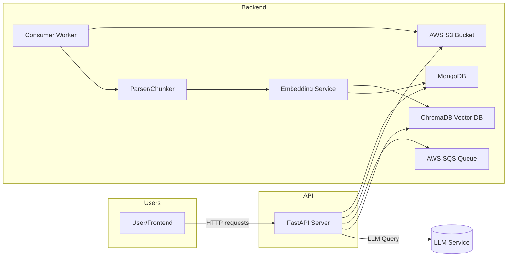
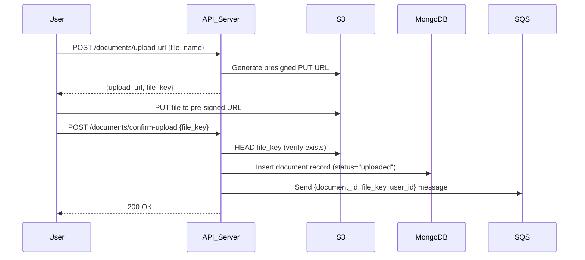
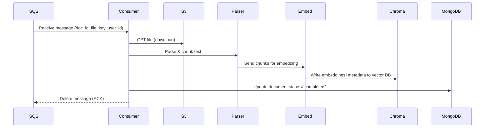
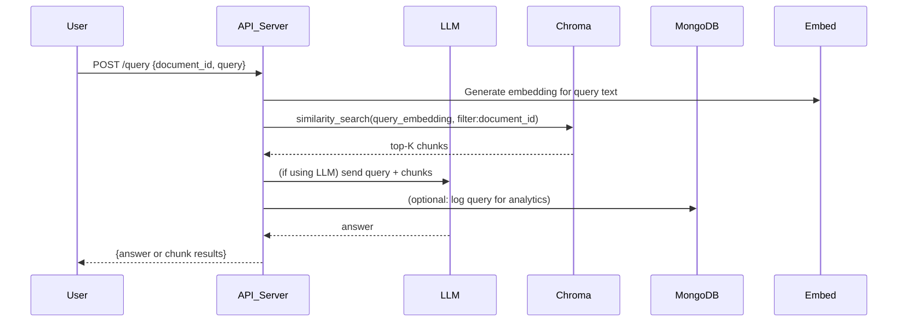
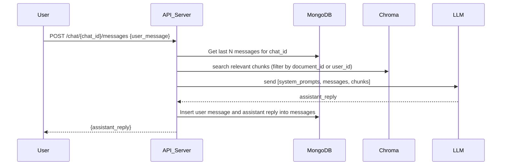
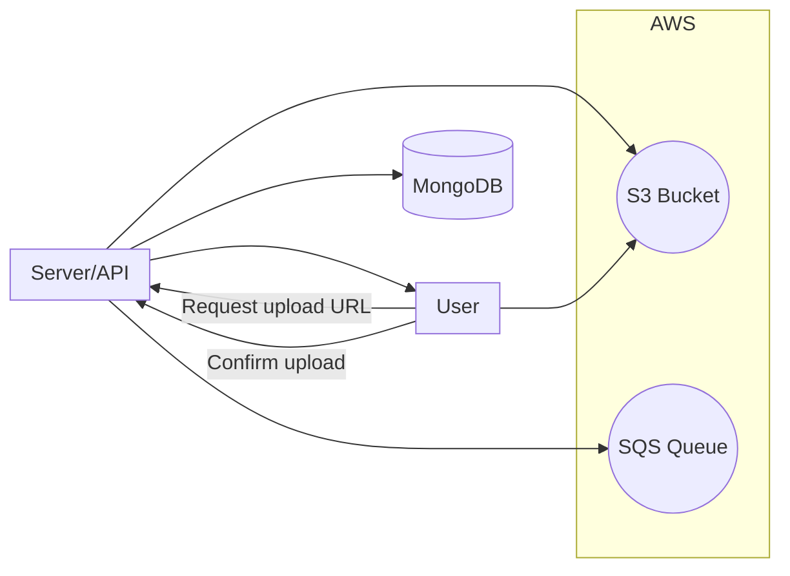
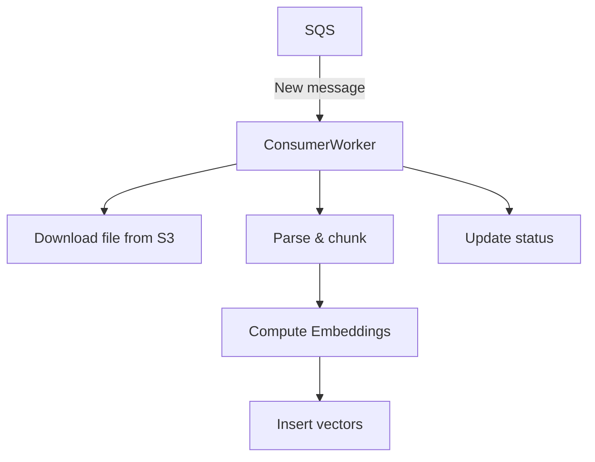
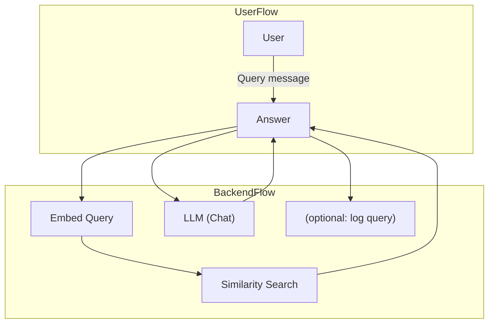
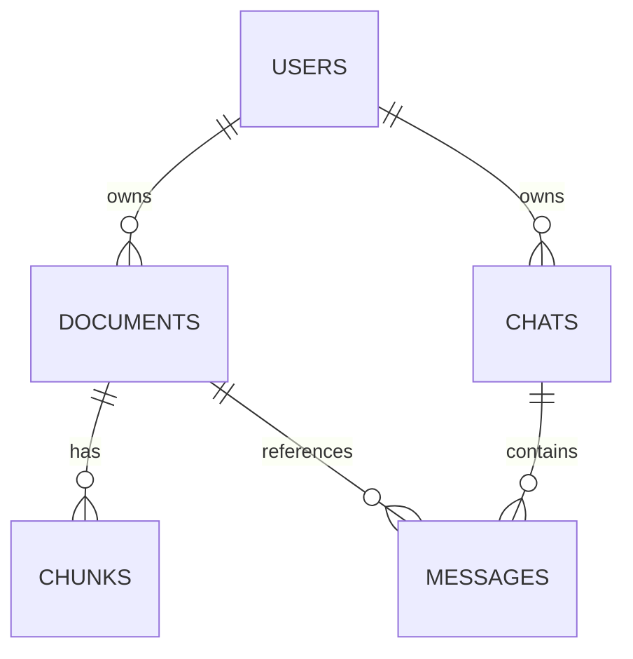
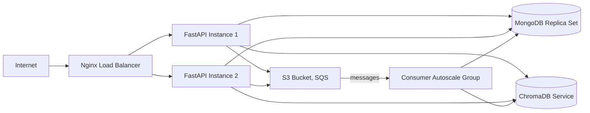

# Executive Summary  
This document provides a **production-grade documentation set** for a RAG (Retrieval-Augmented Generation) application built with FastAPI, AWS services (S3, SQS), a background consumer/embedding pipeline, ChromaDB (vector database), and MongoDB (metadata store).  It is intended for engineers and SREs to understand, deploy, and operate the system without prior knowledge.  The deliverables include an architecture overview (with diagrams), end-to-end workflows, OpenAPI-style API references, database and vector-store schema definitions (with sample documents and indexes), deployment and security design, logging/monitoring metrics, error handling procedures, scaling strategy, disaster recovery, and a detailed table of contents.  Where relevant, we cite official documentation and research (e.g. AWS, MongoDB, Chroma, OpenAI) to support design choices and best practices.  

# Table of Contents  
1. [System Architecture Overview](#system-architecture-overview)  
   1.1 [Architecture Diagram](#architecture-diagram)  
   1.2 [Component Responsibilities](#component-responsibilities)  
2. [Data Model and Database Design](#data-model-and-database-design)  
   2.1 [MongoDB Collections (Schemas)](#mongodb-collections-schemas)  
   2.2 [MongoDB Indexes (Recommended)](#mongodb-indexes-recommended)  
   2.3 [ChromaDB Collection and Schema](#chromadb-collection-and-schema)  
   2.4 [Embedding and Similarity Metrics](#embedding-and-similarity-metrics)  
3. [API Design](#api-design)  
   3.1 [Authentication (JWT)](#authentication-jwt)  
   3.2 [File Upload APIs (Presigned URLs)](#file-upload-apis-presigned-urls)  
   3.3 [Document Management APIs](#document-management-apis)  
   3.4 [Retrieval API](#retrieval-api)  
   3.5 [Chat API](#chat-api)  
   3.6 [Health and Monitoring API](#health-and-monitoring-api)  
4. [Workflows (End-to-End)](#workflows-end-to-end)  
   4.1 [Document Upload Workflow](#document-upload-workflow)  
   4.2 [Document Processing Workflow](#document-processing-workflow)  
   4.3 [Query Retrieval Workflow](#query-retrieval-workflow)  
   4.4 [Chat Conversation Workflow](#chat-conversation-workflow)  
5. [Sequence and Flow Diagrams](#sequence-and-flow-diagrams)  
   5.1 [Diagram: Document Upload](#diagram-document-upload)  
   5.2 [Diagram: Document Processing](#diagram-document-processing)  
   5.3 [Diagram: Query and Chat Flows](#diagram-query-and-chat-flows)  
   5.4 [ER Diagram (Data Model)](#er-diagram-data-model)  
   5.5 [Deployment Topology](#deployment-topology)  
6. [API Reference (OpenAPI-style)](#api-reference-openapi-style)  
   6.1 [Generate Upload URL](#generate-upload-url)  
   6.2 [Confirm Upload](#confirm-upload)  
   6.3 [Query/Retrieval](#queryretrieval)  
   6.4 [Chat](#chat)  
   6.5 [Health Check](#health-check)  
7. [Deployment Architecture](#deployment-architecture)  
   7.1 [Production Deployment Diagram](#production-deployment-diagram)  
   7.2 [Docker/Docker-Compose Setup](#docker-docker-compose-setup)  
   7.3 [Infrastructure Components](#infrastructure-components)  
8. [Security Design](#security-design)  
   8.1 [Authentication and Authorization](#authentication-and-authorization)  
   8.2 [S3 Security (Presigned URLs)](#s3-security-presigned-urls)  
   8.3 [API Security (Validation, Rate Limits)](#api-security-validation-rate-limits)  
9. [Logging, Monitoring, and Metrics](#logging-monitoring-and-metrics)  
   9.1 [Logging Strategy and Format](#logging-strategy-and-format)  
   9.2 [Key Metrics and Dashboards](#key-metrics-and-dashboards)  
   9.3 [Alerting and Thresholds](#alerting-and-thresholds)  
10. [Error Handling and Runbook](#error-handling-and-runbook)  
    10.1 [Common Failure Scenarios](#common-failure-scenarios)  
    10.2 [Recovery Procedures](#recovery-procedures)  
11. [Scaling and Performance](#scaling-and-performance)  
    11.1 [API Service Scaling](#api-service-scaling)  
    11.2 [Consumer and Embedding Scaling](#consumer-and-embedding-scaling)  
    11.3 [Database Scaling](#database-scaling)  
12. [Disaster Recovery and Backups](#disaster-recovery-and-backups)  
    12.1 [Data Backups (MongoDB, ChromaDB)](#data-backups-mongodb-chromadb)  
    12.2 [S3 Versioning and Recovery](#s3-versioning-and-recovery)  
    12.3 [Infrastructure Recovery](#infrastructure-recovery)  
13. [Future Enhancements](#future-enhancements)  
    13.1 [Advanced Search (Hybrid, Reranking)](#advanced-search-hybrid-reranking)  
    13.2 [Caching and Speed Optimizations](#caching-and-speed-optimizations)  
    13.3 [Multi-Region Deployment](#multi-region-deployment)  

---

## System Architecture Overview  
The system follows a microservices-style design with decoupled components. A high-level diagram is shown below:



Each component responsibility:  
- **FastAPI Server:** Exposes REST/HTTP APIs (upload URL generation, confirm upload, query, chat). Validates auth (JWT), enforces business logic, and interacts with AWS and databases.  
- **MongoDB:** Stores metadata for documents, chat sessions, users, and stores chat messages and system state.  
- **AWS S3:** Holds raw document files (PDFs, etc.) uploaded by users. Accessed only via presigned URLs (no public objects).  
- **AWS SQS:** Message queue for document processing jobs. When a new document is confirmed, an SQS message is published to trigger processing.  
- **Consumer Worker:** Asynchronously polls SQS, downloads files from S3, processes them through parser/chunker, generates embeddings, and stores vectors in ChromaDB. Also updates MongoDB status.  
- **Parser/Chunker:** Extracts text from documents (PDF, DOCX, etc.), splits into chunks (pages, paragraphs).  
- **Embedding Service:** Calls an ML model (e.g. OpenAI embeddings or local model) to compute vector embeddings for each chunk.  
- **ChromaDB (Vector Database):** Stores embeddings and metadata. Supports similarity search (default L2, can configure cosine) and filters by metadata like document ID.  
- **Retrieval/Chat APIs:** FastAPI endpoints or separate services that query ChromaDB for relevant chunks given a query (embedding). The selected chunks are passed to an LLM (chat completion) to generate an answer. Chat histories are stored in MongoDB.  

This architecture cleanly separates synchronous request handling (FastAPI) from asynchronous heavy processing (worker + vector DB). We use cloud-managed services where appropriate (e.g. S3, SQS, MongoDB Atlas) to simplify operations and scalability.  

## Data Model and Database Design  

### MongoDB Collections (Schemas)  
We define the following collections in MongoDB (sample schemas with example fields):  

- **documents** – Stores metadata for each uploaded document.  
  ```json
  {
    "_id": ObjectId(),
    "user_id": "uuid",
    "file_name": "resume.pdf",
    "file_key": "documents/abc123.pdf",
    "status": "processing",      // e.g., "uploaded", "processing", "completed", "failed"
    "num_pages": 12,
    "metadata": {...},          // e.g., title, author if extracted
    "created_at": ISODate,
    "updated_at": ISODate
  }
  ```  
- **chats** – Stores chat session info (one per conversation).  
  ```json
  {
    "_id": ObjectId(),
    "user_id": "uuid",
    "title": "Resume Chat",
    "document_id": ObjectId(),   // (if chat is tied to a document)
    "created_at": ISODate,
    "updated_at": ISODate
  }
  ```  
- **messages** – Stores individual chat messages within a chat.  
  ```json
  {
    "_id": ObjectId(),
    "chat_id": ObjectId(),  
    "role": "user" | "assistant" | "system",
    "content": "What skills does this resume mention?",
    "timestamp": ISODate
  }
  ```  
- **users** (optional) – If handling own user accounts (or use external auth IDP).  
  ```json
  {
    "_id": ObjectId(),
    "username": "jdoe",
    "hashed_password": "...",
    "email": "jdoe@example.com",
    "created_at": ISODate
  }
  ```  

Each collection may include additional fields as needed (e.g., ratings, tags, etc.). All collections should use ISODate for timestamps. Enforce unique constraints where appropriate (e.g., unique `file_key` per document).  

### MongoDB Indexes (Recommended)  
We add indexes to support common queries. Example indexes with rationale:  

- **documents.user_id (single field)**  
  ```js
  db.documents.createIndex({ user_id: 1 })
  ```  
  *Rationale:* Queries will often fetch all documents for a user (high cardinality = number of users). Index on `user_id` makes “get documents for this user” efficient. If many users have few documents each, cardinality is high.  

- **documents.status** (if filtering by status)  
  ```js
  db.documents.createIndex({ status: 1 })
  ```  
  *Rationale:* Helps the monitoring/admin UI or workers find documents in a given status (e.g., listing all "processing" docs). Status has low cardinality (few possible states) but can be combined in a compound index if needed.  

- **chats.user_id**  
  ```js
  db.chats.createIndex({ user_id: 1 })
  ```  
  *Rationale:* High cardinality by user. Retrieves all chats for a user quickly.  

- **messages.chat_id** (and optionally chat_id + timestamp)  
  ```js
  db.messages.createIndex({ chat_id: 1 })
  db.messages.createIndex({ chat_id: 1, timestamp: 1 })
  ```  
  *Rationale:* Many messages per chat, and chats may be queried by ID. Indexing `chat_id` (and with `timestamp` for sorting) allows efficient retrieval of all messages in a conversation. Cardinality ~ number of distinct chats (many) vs many messages per chat.  

- **users.username / users.email** (if managing own users)  
  ```js
  db.users.createIndex({ username: 1 }, { unique: true })
  db.users.createIndex({ email: 1 }, { unique: true })
  ```  
  *Rationale:* Ensures unique login fields and accelerates lookup by username/email (high cardinality across many users).  

**Index Considerations:** MongoDB documentation advises caution with low-cardinality fields: compound indexes can combine one low-cardinality field with others if the combination is selective【27†L430-L433】. For example, `{status: 1, user_id: 1}` could be used if we often query “documents for this user with status X.” Each index adds overhead (disk/RAM and write cost)【27†L435-L443】, so only add indexes that correspond to actual query patterns. Use the [MongoDB Compass or Atlas tools](https://docs.mongodb.com/) to monitor index usage.  

### ChromaDB Collection and Schema  

We use ChromaDB (an open-source/managed vector DB) to store embeddings of document chunks. Chroma stores *collections* of (id, embedding, document/text, metadata). Example schema:  

- **Collection: document_chunks** (or one collection per user/document)  

Fields for each vector entry:  
```json
{
  "id": "<chunk_uuid>",
  "document_id": "<document_UUID>",   // link to documents._id
  "chunk": "Text of chunk...",
  "page": 5,
  "chunk_index": 3,
  "embedding": [0.12, -0.03, ...],    // numeric vector
  "metadata": {
      "user_id": "user-uuid",
      "file_key": "documents/abc123.pdf",
      // any other metadata used for filtering
  }
}
```  
- **Embedding Vectors:** Dense numeric list (e.g., float32) output by model. Stored by ChromaDB.  
- **Metadata:** Additional info to filter/query, such as `document_id`, `user_id`, page number, chunk index, etc. We can enable indexing on needed metadata fields as per [Chroma Schema docs](https://docs.trychroma.com/cloud/schema/overview)【14†L98-L107】【14†L169-L178】.  

**Indexing and Hybrid Search:** Chroma supports schema configuration. By default, it creates vector index plus default inverted indexes for numeric fields. We can disable string inverted indexes if not needed to speed up writes【14†L169-L178】. If using hybrid sparse search (e.g. keyword search combined with embeddings), we can enable sparse indexes. For example, to add a BM25 text index on chunk text, or to index categorical fields. The Chroma docs note that disabling unneeded indexes “speeds up writes and reduces index build time”【14†L169-L178】.  

### Embedding and Similarity Metrics  

Our choice of embedding model and similarity metric affects performance and accuracy. We should document the selected model (or options). Examples:  

- **OpenAI Embedding Models:** e.g. `text-embedding-3-large` (3072-dim, best performance) or `text-embedding-3-small` (cheaper). According to OpenAI, `text-embedding-3-large` yields up to 3072-dimensional vectors and outperforms previous models on benchmarks【21†L90-L99】. The `-3-small` model provides a cost-efficient alternative with high retrieval scores【21†L71-L80】.  
- **Local / Transformers Models:** E.g. SentenceTransformers like `all-MiniLM-L6-v2` (384-dim) or `all-mpnet-base-v2` (768-dim). These are free/open-source. They have smaller vectors (trade-off accuracy vs cost).  

**Comparison Table (Embeddings):**

| Model                       | Dimensionality | Approx Cost (per 1K tokens)  | Notes                                      |
|-----------------------------|---------------:|----------------------------|--------------------------------------------|
| `text-embedding-3-large`    | 3072           | \$0.00013                 | Best OpenAI embed model, high perf【21†L92-L100】 |
| `text-embedding-3-small`    | (unspecified)  | \$0.00002                 | Efficient, 5× cheaper than ada【21†L71-L80】  |
| `text-embedding-ada-002`    | 1536           | \$0.00010                 | Older model, still supported               |
| SentenceTransformers (MPNet)| 768            | Free (self-host)          | High quality open-source embed              |
| SentenceTransformers (MiniLM)| 384           | Free (self-host)          | Faster, lower dim, for latency-sensitive    |

*(Costs and dimensions from OpenAI announcements【21†L71-L80】【21†L92-L100】; actual choices depend on performance needs and budget.)*  

**Similarity Metrics:** Chroma’s default distance is *L2 (squared Euclidean)*. We can configure it to use cosine or inner-product via `hnsw:space` metadata【19†L158-L164】. According to Chroma and community answers, setting `metadata={"hnsw:space":"cosine"}` at collection creation enables cosine distance【19†L158-L164】. Keep in mind Chroma reports a **distance**: for cosine, it uses `1 - (dot_product)` so closer to 0 means more similar【19†L236-L244】. We should document which metric we use (cosine is common for semantic text, since L2 distance for unit-normalized vectors is proportional to cosine).  

*Table: Similarity Metrics Comparison*

| Metric        | Formula / Interpretation                   | Pros                      | Cons                           |
|---------------|--------------------------------------------|---------------------------|--------------------------------|
| Cosine (via Chroma) | Cosine similarity \( =\frac{A\cdot B}{\|A\|\|B\|} \) (Chroma uses 1 - cos as distance) | Focuses on angle/semantic match; scale invariant | Can yield distances >1? (Chroma squares L2, see below) |
| L2 (Euclidean)        | \( \|A - B\|_2^2 \) (Chroma squared) | Default; simple geometric distance | Sensitive to vector length, requires normalization for text |
| Inner Product (IP)    | \( A \cdot B \)                        | Equivalent to cosine if vectors normalized | Not a distance metric without normalization |

Chroma uses squared L2 by default【19†L158-L164】. We typically normalize vectors and prefer cosine semantics. We'll note any non-default parameter (e.g. `hnsw:space="cosine"` in collection creation) so that retrieval uses cosine similarity.  

## API Design  

All APIs use JSON. We enforce **JWT-based authentication** (e.g. OAuth2/JWT bearer tokens). Unauthorized requests return 401. Use standard HTTP verbs and status codes (200/201/400/404/500, etc.). Include data validation (via Pydantic models) to prevent injection/invalid data.  

### Authentication (JWT)  
- **Token Issuance:** Via /auth endpoint (out of scope) or external identity provider. JWT claims include `sub=user_id`, expiry (`exp`).  
- **Token Validation:** Every API endpoint (except health) checks Authorization: Bearer token, validates signature/expiry.  
- **Authorization:** Ensure users can only access their own documents/chats. Check `document.user_id == token.sub`, etc.  

### File Upload APIs (Presigned URLs)  
We use **AWS S3 presigned URLs** so clients can upload files directly to S3 without exposing credentials. Flow: client calls FastAPI to get an upload URL, then PUTs file to S3, then calls FastAPI to confirm.  

#### Generate Upload URL  
- **Endpoint:** `POST /api/v1/documents/upload-url`  
- **Request JSON:** `{ "file_name": "resume.pdf", "content_type": "application/pdf" }`  
- **Response JSON:** `{ "upload_url": "https://s3.amazonaws.com/...", "file_key": "documents/{uuid}.pdf" }`  
- **Behavior:** Server generates a pre-signed PUT URL with limited TTL (e.g., 15 min) and appropriate ACL/permissions. The `file_key` includes a unique ID (to avoid clashes). The file remains private until uploaded.  
- **Notes:** We should set short expiration (e.g. 900 seconds) and restrict content type/size in the policy. AWS recommends presigned URL expiry and using HTTPS【8†L25-L33】. Content-MD5 can be enforced if needed for integrity.  

#### Confirm Upload  
- **Endpoint:** `POST /api/v1/documents/confirm-upload`  
- **Request JSON:** `{ "file_key": "documents/abc123.pdf", "document_id": "<MongoDB ID>" }`  
- **Response:** 200 on success.  
- **Behavior:** Client calls this after uploading to S3. The server verifies the file exists in S3 (HEAD request) and then creates a document record in MongoDB with status `"uploaded"`. It then enqueues a message to SQS (`{ document_id, file_key, user_id }`). The worker will transition status to `"processing"`.  

### Document Management APIs  
- **List Documents:** `GET /api/v1/documents` returns metadata of user’s documents.  
- **Get Document Info:** `GET /api/v1/documents/{doc_id}` returns metadata (status, pages, etc.).  
- **Delete Document:** `DELETE /api/v1/documents/{doc_id}` removes entry (optionally also delete vectors in Chroma and file in S3).  

These use standard REST patterns. Use appropriate Pydantic schemas for request/response models.  

### Retrieval API  
For answering ad-hoc queries against a document set:  
- **Endpoint:** `POST /api/v1/query`  
- **Request:**  
  ```json
  {
    "document_id": "<UUID>",
    "query": "What skills does this document list?"
  }
  ```  
- **Response:**  
  ```json
  {
    "results": [
      {"text": "...relevant chunk 1...", "score": 0.85},
      {"text": "...chunk 2...", "score": 0.78},
      ...
    ]
  }
  ```  
- **Behavior:** FastAPI takes `query` string, generates an embedding using the chosen model, then calls ChromaDB to similarity-search top-K chunks in the collection filtered by `document_id`. Returns the most similar chunks with scores. Scores can be cosine similarity or 1-distance. If desired, this can also call an LLM to generate an answer (for RAG), but that may be in Chat API.  

### Chat API  
We support conversational chat with context. Example endpoints:  
- **Create Chat Session:** `POST /api/v1/chat` with `{ "title": "Resume QA", "document_id": "<UUID>" }`, returns `{ "chat_id": ... }`. Creates a new chat linked to a document or user.  
- **Send Message:** `POST /api/v1/chat/{chat_id}/messages` with `{ "content": "What skills are present?" }`. Returns assistant reply.  
- **Get Chat History:** `GET /api/v1/chat/{chat_id}` returns all messages.  

*Example:*  
```http
POST /api/v1/chat/1234/messages
Authorization: Bearer <token>
Content-Type: application/json

{ "content": "What skills are present in this resume?" }
```
Response:
```json
{ "reply": "The resume mentions skills in Python, data analysis, and team leadership." }
```
**Behavior:** On message send, the server retrieves past messages from MongoDB, retrieves relevant chunks from Chroma (as context), then calls an LLM (e.g. GPT-4/3.5) with system+user prompts, and returns the answer. The message (user and assistant responses) are saved in `messages` collection.  

### Health and Monitoring API  
- **Endpoint:** `GET /health` returns basic service health (checks connectivity to MongoDB, optionally SQS or LLM). Returns 200 if ok, 500 otherwise.  
- **Metrics Endpoint:** e.g. `/metrics` for Prometheus (if used) exposing counters/timings.  

API endpoints should be documented in OpenAPI (Swagger) format. Example schemas and request/response payloads are given in section 6.  

## Workflows (End-to-End)  

### Document Upload Workflow  
This sequence describes how a file goes from user to queued for processing:  



1. **Generate Upload URL:** Client requests an upload URL with filename and content type. Server returns a pre-signed S3 URL and a unique `file_key`.  
2. **Client Uploads File:** The client PUTs the file to S3 via the presigned URL (direct to S3).  
3. **Confirm Upload:** Client notifies server via API. Server verifies the file is in S3.  
4. **Store Metadata:** Server creates a MongoDB document entry (status `"uploaded"`).  
5. **Enqueue Job:** Server pushes a message to SQS for processing. Job contains pointers to `document_id`, `file_key`, and `user_id`.  
6. **Done:** User receives success (processing asynchronously).  

### Document Processing Workflow  
Once a file is uploaded, the asynchronous pipeline processes it:



1. **Poll Queue:** The consumer (worker) polls SQS. On receiving a message, it becomes invisible to others.  
2. **Download File:** The worker retrieves the file from S3 using the `file_key`.  
3. **Parse/Chunk:** Use PDF/text parsers to extract text, break into manageable chunks (e.g., paragraphs or n-word chunks).  
4. **Embed:** Send each chunk text to the embedding model service (could be local or via API).  
5. **Store in ChromaDB:** Insert each chunk as a new vector record in ChromaDB, with metadata linking back to the original document and chunk info.  
6. **Update Status:** Set `documents.status="completed"` in MongoDB (or "failed" on error).  
7. **Cleanup:** Delete SQS message. If processing fails, let it reappear or move to DLQ after max retries.  

### Query Retrieval Workflow  
When a user makes a retrieval query (not full chat, just get relevant info):



1. **Get Query:** FastAPI endpoint receives search query and document ID.  
2. **Embed Query:** Compute query vector.  
3. **Vector Search:** Query ChromaDB for top-K similar chunk vectors within the given document (filter by metadata document_id).  
4. **LLM Answer (optional):** Optionally, the retrieved text chunks are fed into an LLM to generate a coherent answer.  
5. **Return Response:** Return either raw chunks or LLM-generated answer to user.  

### Chat Conversation Workflow  
For chats (contextual Q&A over multiple turns):



1. **Receive User Message:** Endpoint gets user message with `chat_id`.  
2. **Load Context:** Fetch previous conversation from MongoDB, and relevant context chunks (via vector search).  
3. **Call LLM:** Combine system instructions, chat history, and retrieved context, then call the LLM API (e.g. OpenAI ChatCompletion).  
4. **Save & Return:** Save both user message and LLM response to MongoDB, then return the LLM’s reply.  

## Sequence and Flow Diagrams  

### Diagram: Document Upload  


### Diagram: Document Processing  


### Diagram: Query & Chat Flow  


### ER Diagram (Data Model)  

*Figure: High-level ER diagram of MongoDB collections.*  

### Deployment Topology  

*Figure: Production deployment architecture (multi-instance, AWS services).*  

## API Reference (OpenAPI-style)  

### Generate Upload URL  
```http
POST /api/v1/documents/upload-url
Authorization: Bearer <token>
Content-Type: application/json
```
**Request JSON:**  
```json
{
  "file_name": "resume.pdf",
  "content_type": "application/pdf"
}
```  
**Response 200:**  
```json
{
  "upload_url": "https://s3.amazonaws.com/bucket/documents/1234-abc.pdf?AWSAccessKeyId=...",
  "file_key": "documents/1234-abc.pdf"
}
```  

This endpoint creates a presigned PUT URL for S3. The `file_key` is the S3 object key to use. The URL expires after a short time (e.g. 15 minutes).  

### Confirm Upload  
```http
POST /api/v1/documents/confirm-upload
Authorization: Bearer <token>
Content-Type: application/json
```
**Request JSON:**  
```json
{
  "document_id": "64f0d3c1...",
  "file_key": "documents/1234-abc.pdf"
}
```  
**Response 200:**  
```json
{
  "status": "queued"
}
```  

The server verifies the file exists at `file_key` in S3, then updates the MongoDB `documents` record and enqueues a message to SQS for processing. It returns status "queued".  

### Query/Retrieval API  
```http
POST /api/v1/query
Authorization: Bearer <token>
Content-Type: application/json
```
**Request JSON:**  
```json
{
  "document_id": "64f0d3c1...",
  "query": "List all programming skills mentioned."
}
```  
**Response 200:**  
```json
{
  "results": [
    {"chunk_id": "chunk-uuid-1", "text": "Proficient in Python and Java.", "score": 0.87},
    {"chunk_id": "chunk-uuid-2", "text": "Experience with JavaScript and SQL.", "score": 0.81}
  ]
}
```  

Retrieval may also optionally return an LLM-generated answer. Use query embeddings and Chroma similarity search (cosine by default).  

### Chat API (Message)  
```http
POST /api/v1/chat/{chat_id}/messages
Authorization: Bearer <token>
Content-Type: application/json
```
**Request JSON:**  
```json
{
  "content": "What is the candidate's main expertise?"
}
```  
**Response 200:**  
```json
{
  "assistant_reply": "The candidate's main expertise is in data science and machine learning, as indicated by ...",
  "chat_id": "9876-fedc"
}
```  

Creates a new user message, retrieves context, calls LLM, stores both messages.  

### Health Check  
```http
GET /api/v1/health
```
**Response 200:**  
```json
{ "status": "ok", "db": "up", "queue": "up" }
```  

Quick check for system status (could integrate with load balancer or Kubernetes liveness).  

*(Similarly, document any additional endpoints with paths, request/response JSON, and descriptions.)*  

## Deployment Architecture  

### Production Deployment Diagram  
Above we sketched a sample production topology. Key points:  

- **Load Balancer / API Gateway:** Routes traffic to a pool of FastAPI application instances (Docker containers). E.g., Nginx or AWS ALB.  
- **FastAPI Instances:** Run Uvicorn/Gunicorn workers. Each container connects to MongoDB and ChromaDB, and has AWS credentials (IAM role) to S3/SQS.  
- **MongoDB:** Use a managed replica set (like MongoDB Atlas) for HA. Secondary could be delayed or hidden for backups.  
- **ChromaDB:** Could run as a service (self-hosted or managed). Ensure it has enough memory for vector index.  
- **AWS Services:** S3 (for files) and SQS (for queue) are fully managed. SQS triggers the autoscaling of consumer workers.  
- **Consumer Worker Pool:** The worker service can scale horizontally (e.g., via Kubernetes/HPA or AWS ECS/AutoScaling) based on SQS queue depth. Each consumer instance polls the queue.  
- **LLM Service:** The actual LLM (e.g., OpenAI ChatAPI) is external; calls are made from the FastAPI server (with retry/backoff).  

### Docker / Docker-Compose Setup  
A simplified `docker-compose.yml` might include:  
```yaml
version: "3.8"
services:
  api:
    build: ./backend
    env_file: .env
    ports: ["8000:8000"]
    depends_on:
      - mongodb
      - chromadb
    volumes:
      - ./logs:/app/logs
  consumer:
    build: ./consumer
    depends_on:
      - mongodb
      - chromadb
    env_file: .env
  mongodb:
    image: mongo:6
    volumes: [mongo-data:/data/db]
    ports: ["27017:27017"]
  chromadb:
    image: chromadb/chroma:latest
    ports: ["8000:8000"]
    volumes: [chromadb-data:/data]
  nginx:
    image: nginx
    ports: ["80:80"]
volumes:
  mongo-data:
  chromadb-data:
```
- **Ports:** `api` on 8000, `nginx` on 80.  
- **Volumes:** Persist MongoDB and ChromaDB data.  
- **Scaling:** In production, use separate managed services and container orchestrator; this is for local/dev.  

### Infrastructure Components  
List actual deployed pieces:  
- MongoDB Replica Set (Primary + 2+ secondaries, ideally in different AZs)  
- ChromaDB (can use multi-AZ or cluster if high availability needed)  
- S3 bucket (private, with versioning enabled for recovery).  
- SQS queue (standard queue; see configuration below).  
- API servers (in autoscaling group or k8s).  
- Worker pool (autoscale based on queue depth).  
- Nginx or AWS ALB for TLS termination.  

Ensure all network traffic is secured (TLS on API, VPC endpoints for S3/SQS if on AWS).  

## Security Design  

### Authentication & Authorization  
- **Auth Method:** JWT (OIDC/OAuth2). Include `sub=user_id` in token. Use HTTPS for all API calls.  
- **Access Control:** Check that `user_id` from JWT matches `user_id` on any document/chat resource. Return 403 if mismatch. Isolate user data.  

### S3 Security (Presigned URLs)  
- **Private Bucket:** S3 bucket is private; no public access. All uploads/downloads via presigned URLs.  
- **Presigned URL Usage:** URLs expire (e.g. 15 min) and allow exactly the intended operation (PUT only for upload). AWS uses Signature V4 for presigned URLs【10†L25-L33】.  
- **Bucket Policies:** Can restrict uploads by bucket path prefix or content type if needed. AWS recommends short expiration and verifying allowed actions【10†L25-L33】.  
- **Encryption:** Use S3 SSE-KMS to encrypt objects at rest. The presigned URL can include KMS encryption if required.  

### API Security  
- **HTTPS Everywhere:** All endpoints exposed via HTTPS.  
- **Rate Limiting:** Apply per-IP or per-user rate limits (e.g., 100 req/min) to prevent abuse (can use FastAPI middleware or API gateway rules).  
- **Input Validation:** Use Pydantic to enforce strict schemas, preventing injection. Sanitize file names and other user inputs.  
- **CORS:** Set appropriate CORS rules for frontend domain if any.  
- **Penetration Protection:** Keep frameworks/libraries up to date; use tools like Bandit to scan Python code for vulns.  

## Logging, Monitoring, and Metrics  

### Logging Strategy and Format  
- **Structured JSON Logs:** Each service logs in JSON format with fields like `timestamp`, `service`, `level`, `message`, `request_id`, `user_id` (if applicable), and context info. Example:  
  ```json
  {
    "timestamp": "2026-05-31T09:15:27Z",
    "service": "fastapi",
    "level": "INFO",
    "request_id": "abc123",
    "user_id": "user-uuid",
    "message": "Document upload URL generated"
  }
  ```  
- **Log Levels:** Use `DEBUG` for internal tracing (off in prod), `INFO` for high-level operations, `WARN` for recoverable issues, `ERROR` for failures.  
- **Correlation IDs:** Generate a unique `request_id` per HTTP request (e.g., using `X-Request-ID` header) and propagate it to all logs and sub-components for tracing.  

### Key Metrics and Dashboards  
Instrument the system with metrics (export via Prometheus or CloudWatch):  
- **API Metrics:** request count, latency (P50/P95), error rate per endpoint.  
- **Queue Metrics:** SQS queue depth, age of oldest message.  
- **Processing Metrics:** Document processing time (per doc), chunks processed per second, embedding requests.  
- **DB Metrics:** MongoDB connection count, query latencies, cache hits; ChromaDB index/query latencies, memory usage.  
- **Search Metrics:** Embedding time, retrieval time (Chroma query time).  
- **User-Facing Metrics:** e.g. upload success rate, average query response time.  

*Prometheus Dashboards:* Create dashboards showing time-series of key metrics. Tag metrics by service. For example, track `fastapi_requests_total{endpoint="/api/v1/query"}` with success vs error codes.  

### Alerting and Thresholds  
Define alerts (e.g., in PagerDuty/CloudWatch Alarms) for:  
- **High Error Rates:** e.g. >5% 5xx rate on any API for 5 min.  
- **API Latency:** P95 > 1s.  
- **Queue Backlog:** SQS messages > 1000 (indicating lag).  
- **Consumer Failures:** Repeated processing errors or messages in DLQ.  
- **DB Issues:** MongoDB primary unavailable, or top of OpsLog delay.  
- **Resource Utilization:** High CPU/memory on API or worker VMs.  

Set sensible default thresholds (to be tuned by traffic patterns). For example, alert if queue size > 500 for 10m, or if upload success rate < 90% in an hour.  

## Error Handling and Runbook  

### Common Failure Scenarios  
1. **Upload Failures:** S3 upload error (network issue, size too large). *Response:* Return 500 to client.  
2. **SQS Publish Failure:** Unable to enqueue job. *Response:* Log error, retry, or alert.  
3. **Consumer Errors:** Document parse failure (e.g. unsupported format), embedding API failure, or ChromaDB write failure.  
4. **ChromaDB Issues:** Out-of-memory or indexing errors.  
5. **MongoDB Errors:** Connection errors, write conflicts.  
6. **LLM Timeout/Errors:** Chat or query calls fail or timeout.  

### Recovery Procedures (Sample Runbook Steps)  
- **S3 Upload:**  
  - *Symptom:* Client reports upload error. Check S3 bucket policies and presigned URL expiry.  
  - *Action:* Verify bucket path exists and IAM permissions. Generate a new presigned URL (server-side) and retry.  

- **SQS Processing Errors:**  
  - *Symptom:* Messages stuck in DLQ or repeatedly failing.  
  - *Action:* Inspect DLQ via AWS console. Check consumer logs for exception. Fix root cause (e.g., parsing code) and use SQS redrive to reprocess or delete bad message. Ensure `maxReceiveCount` is set high enough (e.g. >3) before DLQ【5†L51-L59】.  

- **Consumer/Parser Errors:**  
  - *Symptom:* Document status remains “processing” and no further progress.  
  - *Action:* Check consumer logs for exceptions. If a particular file is bad, consider storing that error in MongoDB (`status="failed"`). Manually delete or requeue message. Use health checks on consumer.  

- **ChromaDB Failures:**  
  - *Symptom:* Inserting vectors fails or search returns empty.  
  - *Action:* Check ChromaDB service health, logs. Possibly restart Chroma service. If index corrupted, re-initialize collection from backup.  

- **Database Backup/Restore:**  
  - *MongoDB:* If data corruption or instance failure, restore from latest snapshot/backup. For quick fix, promote a secondary to primary.  
  - *ChromaDB:* If using local Chroma, take periodic backups (dump vectors and metadata). Restore using `collection.add` scripts.  

- **LLM API Issues:**  
  - *Symptom:* Chat or query timed out or returned error.  
  - *Action:* Implement retry with exponential backoff. Alert if rates high.  

Include contact info, escalation path, and runbook checks (e.g., ping endpoints, tail logs).  

## Scaling and Performance  

### API Service Scaling  
- **Horizontal Scaling:** Deploy multiple FastAPI containers behind a load balancer. They are stateless (except DB), so scale by increasing instances.  
- **Resources:** Use Gunicorn/Uvicorn with appropriate worker counts (e.g. 2-4 per CPU core). Monitor CPU/memory usage and scale out before CPU hits 70%.  
- **Auto-Scaling:** Configure auto-scaling rules (e.g. AWS ECS or Kubernetes HPA) based on CPU or request rate.  

### Consumer and Embedding Scaling  
- **Workers:** The document parser/embedding consumer should run as a separate service, horizontally scaled. It reads from SQS.  
- **Idempotency:** Design consumer to be idempotent (e.g. check if vectors already exist before adding). Use message De-duplication for FIFO queues or application-level dedupe.  
- **Parallelism:** If parsing multiple pages, you can parallelize embedding calls.  
- **Auto-Scaling:** Scale based on SQS queue length (AWS Application Auto Scaling can increase consumer instances when messages pile up). Set a high maxReceiveCount so messages don’t prematurely go to DLQ【5†L51-L59】.  

### Database Scaling  
- **MongoDB:** Use a managed cluster with replication for HA. Scale reads via secondaries if needed (for analytics/reporting). If write-heavy, consider sharding (less likely for this use-case unless huge scale).  
- **ChromaDB:** If self-hosting, ensure enough memory for index. Chroma can run in multi-tenant mode; for high load, deploy multiple independent collections or instances. Vector search is memory-intensive, so vertical scaling or splitting data by tenant may be necessary.  
- **Caching:** Implement an LRU or Redis cache for repeated queries/chunks if certain documents are queried often.  

## Disaster Recovery and Backups  

### Data Backups (MongoDB, ChromaDB)  
- **MongoDB:** Use scheduled snapshots (e.g. Atlas backups) daily, with point-in-time recovery (oplog). Regularly test restores.  
- **ChromaDB:** Not a built-in backup; we should periodically export vector collections. For example, run a script to dump all vectors and metadata (store in S3). In a disaster, recreate the Chroma collection by re-running embedding on saved raw texts or by restoring from dumps.  
- **Chat Logs:** The `messages` are in Mongo, covered by its backup.  

### S3 Versioning and Recovery  
- **Enable Versioning:** Turn on S3 versioning on the bucket. This protects against accidental deletes/overwrites of documents.  
- **MFA Delete:** For extra security, enable MFA Delete if critical.  
- **Recovery:** If a user’s file is overwritten, restore previous version via AWS console or API.  

### Infrastructure Recovery  
- **Multi-AZ Deployments:** For DB and service components, use multiple availability zones.  
- **Infrastructure as Code:** Use IaC (Terraform/CloudFormation) so entire setup can be reprovisioned.  
- **Rollback Plan:** For new releases, maintain ability to rollback containers. Use blue/green or canary deployments to minimize downtime.  
- **DR Drills:** Periodically run failover tests: e.g., take down primary DB, ensure secondary promotes correctly.  

## Future Enhancements  
- **Hybrid Search:** Combine vector search (Chroma) with a sparse retriever (like Elasticsearch or Chroma’s sparse indexes) to use keyword matching. Chroma supports hybrid RRF ranking【14†L169-L178】.  
- **Caching Layer:** Add Redis caching for popular queries or recent chat contexts to reduce load.  
- **OpenSearch/Elastic:** For full-text search on documents (complementing vector search).  
- **Streaming API:** Use LLM streaming for faster partial responses (if supported by model).  
- **Role-Based Access:** If multiple user roles, add fine-grained auth (e.g., admins vs users).  
- **Multilingual Support:** Add embeddings/models for different languages.  
- **Multi-Document Retrieval:** Allow queries across multiple documents or entire knowledge base.  

---

**Sources:** We based design decisions on official documentation and research. For example, AWS SQS best practices recommend using Dead-Letter Queues with appropriate retry counts【5†L51-L59】. ChromaDB docs highlight configuring indexes and hybrid search for performance【14†L98-L107】【16†L1-L4】. OpenAI papers describe new embedding models (`text-embedding-3-small/large`) with performance benchmarks【21†L71-L80】【21†L92-L100】. MongoDB guidance advises on index cardinality and usage costs【27†L428-L433】【27†L435-L443】. These and other sources inform the recommendations above. The documentation artifacts (architecture diagrams, API specs, workflows, indexes, etc.) should be maintained in source control alongside the code (e.g. Markdown + Mermaid). This ensures the documentation evolves with the system.